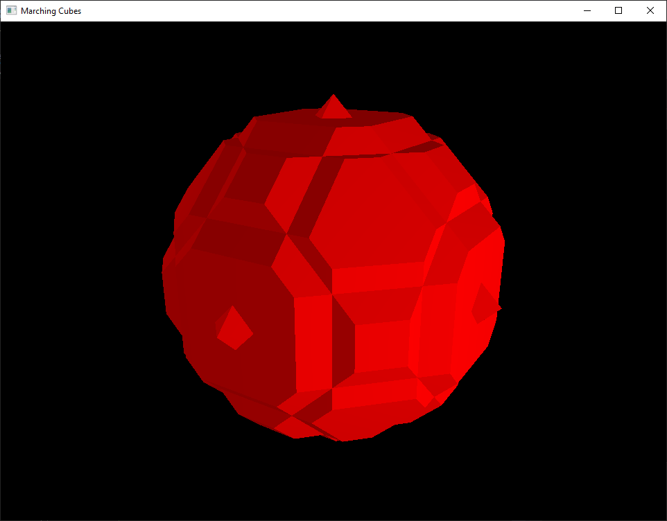

# Marching Cubes

CS 553/453 Final Project

Ashley Pettibone, Kyle Hiebel, Braeden Kuether

# Building Instructions

1. Open MarchingCubes.sln
2. Set the startup project to MarchingCubes.vsproj (Note: We already generated all datasets so there is no need to run DataGen.vsproj)
3. Change the configuration to Release for better performance
4. Press F5 to compile and run (Note: OpenMP must be enabled to properly compile)
5. Use the number keys [1-4] to cycle between visualization modes. Use the mouse to rotate the visualization

### 1. Point Cloud

### 2. Lines

### 3. Cubes

### 4. Marching Cubes

